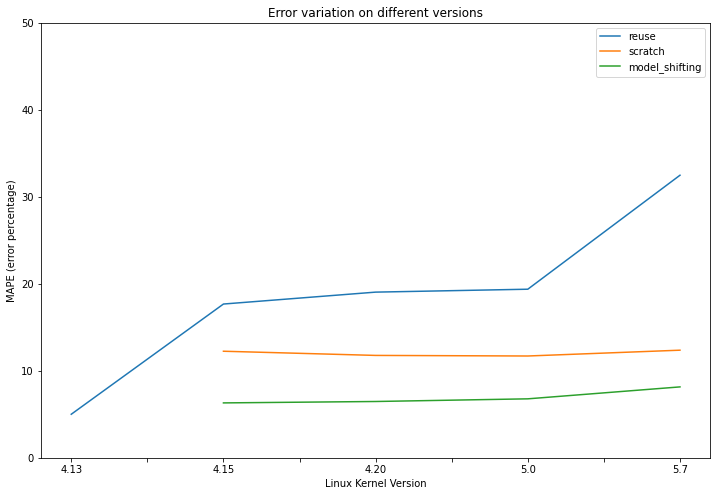

# Linux Transfer Learning notebook - Summary


```python
size_columns = ["GZIP-bzImage", "GZIP-vmlinux", "GZIP", "BZIP2-bzImage", "vmlinux", 
              "BZIP2-vmlinux", "BZIP2", "LZMA-bzImage", "LZMA-vmlinux", "LZMA", "XZ-bzImage", "XZ-vmlinux", "XZ", 
              "LZO-bzImage", "LZO-vmlinux", "LZO", "LZ4-bzImage", "LZ4-vmlinux", "LZ4"]
```

## Training model on 4.13 data


```python
import pandas as pd
from sklearn import ensemble, tree
from sklearn.model_selection import train_test_split

df_413 = pd.read_pickle("datasets/dataset_413.pkl")

train_size = 0.9
X_train, X_test, y_train, y_test = train_test_split(df_413.drop(columns=size_columns+["cid"], errors="ignore"), df_413["vmlinux"], train_size=train_size)

reg = ensemble.GradientBoostingRegressor(n_estimators=100, max_depth=12, min_samples_split=100)
reg.fit(X_train, y_train)

y_pred = reg.predict(X_test)

dfErrorsFold = pd.DataFrame({"% error":((y_pred - y_test)/y_test).abs()*100})
error_413 = dfErrorsFold["% error"].mean()
print("MAPE for 4.13 : ", error_413)
```

    MAPE for 4.13 :  5.007147736246703


## Importing all datasets


```python
df_415 = pd.read_pickle("datasets/dataset_415.pkl")
df_420 = pd.read_pickle("datasets/dataset_420.pkl")
df_500 = pd.read_pickle("datasets/dataset_500.pkl")
df_507 = pd.read_pickle("datasets/dataset_507.pkl")
```

## Creating all training and test sets


```python
columns_413 = set(df_413.columns.values)
columns_415 = set(df_415.columns.values)
columns_420 = set(df_420.columns.values)
columns_500 = set(df_500.columns.values)
columns_507 = set(df_507.columns.values)
```


```python
for c in columns_413.difference(columns_415):
    df_415 = df_415.assign(**{c:1})

for c in columns_413.difference(columns_420):
    df_420 = df_420.assign(**{c:1})

for c in columns_413.difference(columns_500):
    df_500 = df_500.assign(**{c:1})

for c in columns_413.difference(columns_507):
    df_507 = df_507.assign(**{c:1})
```


```python
train_size = 5000

X_train_415, X_test_415, y_train_415, y_test_415 = train_test_split(df_415.drop(columns=size_columns+["cid"], errors="ignore"), df_415["vmlinux"], train_size=train_size)
X_train_420, X_test_420, y_train_420, y_test_420 = train_test_split(df_420.drop(columns=size_columns+["cid"], errors="ignore"), df_420["vmlinux"], train_size=train_size)
X_train_500, X_test_500, y_train_500, y_test_500 = train_test_split(df_500.drop(columns=size_columns+["cid"], errors="ignore"), df_500["vmlinux"], train_size=train_size)
X_train_507, X_test_507, y_train_507, y_test_507 = train_test_split(df_507.drop(columns=size_columns+["cid"], errors="ignore"), df_507["vmlinux"], train_size=train_size)
```

## Model reuse


```python
y_pred = reg.predict(X_test_415[X_train.columns])

dfErrorsFold = pd.DataFrame({"% error":((y_pred - y_test_415)/y_test_415).abs()*100})
error_415 = dfErrorsFold["% error"].mean()
print("MAPE for 4.15 : ", error_415)
```

    MAPE for 4.15 :  17.679421157044988


```python
y_pred = reg.predict(X_test_420[X_train.columns])

dfErrorsFold = pd.DataFrame({"% error":((y_pred - y_test_420)/y_test_420).abs()*100})
error_420 = dfErrorsFold["% error"].mean()
print("MAPE for 4.20 : ", error_420)

y_pred = reg.predict(X_test_500[X_train.columns])

dfErrorsFold = pd.DataFrame({"% error":((y_pred - y_test_500)/y_test_500).abs()*100})
error_500 = dfErrorsFold["% error"].mean()
print("MAPE for 5.0 : ", error_500)

y_pred = reg.predict(X_test_507[X_train.columns])

dfErrorsFold = pd.DataFrame({"% error":((y_pred - y_test_507)/y_test_507).abs()*100})
error_507 = dfErrorsFold["% error"].mean()
print("MAPE for 5.7 : ", error_507)
```

    MAPE for 4.20 :  19.04819421480541
    MAPE for 5.0 :  19.383366075624473
    MAPE for 5.7 :  32.48902869261508


## Training from scratch


```python
reg_415 = ensemble.GradientBoostingRegressor(n_estimators=100, max_depth=12, min_samples_split=100)
reg_415.fit(X_train_415, y_train_415)

y_pred = reg_415.predict(X_test_415)

dfErrorsFold = pd.DataFrame({"% error":((y_pred - y_test_415)/y_test_415).abs()*100})
error_415_scratch = dfErrorsFold["% error"].mean()
print("MAPE for 4.15 scratch : ", error_415_scratch)
```

    MAPE for 4.15 scratch :  12.252710542790119


```python
reg_420 = ensemble.GradientBoostingRegressor(n_estimators=100, max_depth=12, min_samples_split=100)
reg_420.fit(X_train_420, y_train_420)

y_pred = reg_420.predict(X_test_420)

dfErrorsFold = pd.DataFrame({"% error":((y_pred - y_test_420)/y_test_420).abs()*100})
error_420_scratch = dfErrorsFold["% error"].mean()
print("MAPE for 4.20 scratch : ", error_420_scratch)


reg_500 = ensemble.GradientBoostingRegressor(n_estimators=100, max_depth=12, min_samples_split=100)
reg_500.fit(X_train_500, y_train_500)

y_pred = reg_500.predict(X_test_500)

dfErrorsFold = pd.DataFrame({"% error":((y_pred - y_test_500)/y_test_500).abs()*100})
error_500_scratch = dfErrorsFold["% error"].mean()
print("MAPE for 5.0 scratch : ", error_500_scratch)


reg_507 = ensemble.GradientBoostingRegressor(n_estimators=100, max_depth=12, min_samples_split=100)
reg_507.fit(X_train_507, y_train_507)

y_pred = reg_507.predict(X_test_507)

dfErrorsFold = pd.DataFrame({"% error":((y_pred - y_test_507)/y_test_507).abs()*100})
error_507_scratch = dfErrorsFold["% error"].mean()
print("MAPE for 5.7 scratch : ", error_507_scratch)
```

    MAPE for 4.20 scratch :  11.771949694977913
    MAPE for 5.0 scratch :  11.704309483270574
    MAPE for 5.7 scratch :  12.373115863413082


```python
X_train_415["estimated_vmlinux"] = reg.predict(X_train_415[X_train.columns])
X_train_420["estimated_vmlinux"] = reg.predict(X_train_420[X_train.columns])
X_train_500["estimated_vmlinux"] = reg.predict(X_train_500[X_train.columns])
X_train_507["estimated_vmlinux"] = reg.predict(X_train_507[X_train.columns])

X_test_415["estimated_vmlinux"] = reg.predict(X_test_415[X_train.columns])
X_test_420["estimated_vmlinux"] = reg.predict(X_test_420[X_train.columns])
X_test_500["estimated_vmlinux"] = reg.predict(X_test_500[X_train.columns])
X_test_507["estimated_vmlinux"] = reg.predict(X_test_507[X_train.columns])
```

## Model shifting


```python

shifting_gbt_415 = ensemble.GradientBoostingRegressor(n_estimators=200, max_depth=6, min_samples_split=50)
shifting_gbt_415.fit(X_train_415, y_train_415)

y_pred = shifting_gbt_415.predict(X_test_415)

dfErrorsFold = pd.DataFrame({"% error":((y_pred - y_test_415)/y_test_415).abs()*100})
error_415_shifting = dfErrorsFold["% error"].mean()
print("MAPE for 4.15 shifting : ", error_415_shifting)
```

    MAPE for 4.15 shifting :  6.311641375430209


```python
shifting_gbt_420 = ensemble.GradientBoostingRegressor(n_estimators=200, max_depth=6, min_samples_split=50)
shifting_gbt_420.fit(X_train_420, y_train_420)

y_pred = shifting_gbt_420.predict(X_test_420)

dfErrorsFold = pd.DataFrame({"% error":((y_pred - y_test_420)/y_test_420).abs()*100})
error_420_shifting = dfErrorsFold["% error"].mean()
print("MAPE for 4.20 shifting : ", error_420_shifting)


shifting_gbt_500 = ensemble.GradientBoostingRegressor(n_estimators=200, max_depth=6, min_samples_split=50)
shifting_gbt_500.fit(X_train_500, y_train_500)

y_pred = shifting_gbt_500.predict(X_test_500)

dfErrorsFold = pd.DataFrame({"% error":((y_pred - y_test_500)/y_test_500).abs()*100})
error_500_shifting = dfErrorsFold["% error"].mean()
print("MAPE for 5.0 shifting : ", error_500_shifting)


shifting_gbt_507 = ensemble.GradientBoostingRegressor(n_estimators=200, max_depth=6, min_samples_split=50)
shifting_gbt_507.fit(X_train_507, y_train_507)

y_pred = shifting_gbt_507.predict(X_test_507)

dfErrorsFold = pd.DataFrame({"% error":((y_pred - y_test_507)/y_test_507).abs()*100})
error_507_shifting = dfErrorsFold["% error"].mean()
print("MAPE for 5.7 shifting : ", error_507_shifting)


```

    MAPE for 4.20 shifting :  6.473663536704875
    MAPE for 5.0 shifting :  6.779563709785829
    MAPE for 5.7 shifting :  8.151901990142788


## Plotting


```python
df = pd.DataFrame(
{
    "4.13":{
        "reuse":error_413
    },
    "4.15":{
        "reuse":error_415,
        "scratch":error_415_scratch,
        "model_shifting":error_415_shifting
    },
    "4.20":{
        "reuse":error_420,
        "scratch":error_420_scratch,
        "model_shifting":error_420_shifting
    },
    "5.0":{
        "reuse":error_500,
        "scratch":error_500_scratch,
        "model_shifting":error_500_shifting
    },
    "5.7":{
        "reuse":error_507,
        "scratch":error_507_scratch,
        "model_shifting":error_507_shifting
    }
}).T
```


```python
df
```


<div>
<style scoped>
    .dataframe tbody tr th:only-of-type {
        vertical-align: middle;
    }

    .dataframe tbody tr th {
        vertical-align: top;
    }

    .dataframe thead th {
        text-align: right;
    }
</style>
<table border="1" class="dataframe">
  <thead>
    <tr style="text-align: right;">
      <th></th>
      <th>reuse</th>
      <th>scratch</th>
      <th>model_shifting</th>
    </tr>
  </thead>
  <tbody>
    <tr>
      <th>4.13</th>
      <td>5.007148</td>
      <td>NaN</td>
      <td>NaN</td>
    </tr>
    <tr>
      <th>4.15</th>
      <td>17.679421</td>
      <td>12.252711</td>
      <td>6.311641</td>
    </tr>
    <tr>
      <th>4.20</th>
      <td>19.048194</td>
      <td>11.771950</td>
      <td>6.473664</td>
    </tr>
    <tr>
      <th>5.0</th>
      <td>19.383366</td>
      <td>11.704309</td>
      <td>6.779564</td>
    </tr>
    <tr>
      <th>5.7</th>
      <td>32.489029</td>
      <td>12.373116</td>
      <td>8.151902</td>
    </tr>
  </tbody>
</table>
</div>


```python
ax = df.plot(figsize=(12,8), ylim=(0, 50))
ax.set_ylabel("MAPE (error percentage)")
ax.set_xlabel("Linux Kernel Version")
ax.set_title("Error variation on different versions")

```


    Text(0.5, 1.0, 'Error variation on different versions')





The blue line is the error of the 4.13 model on the different versions. Orange line is the error rate for models build from scratch on 5000 examples of the studied version. Green line is the shifting of the 4.13 model using 5000 examples from the studied version.


```python

```
